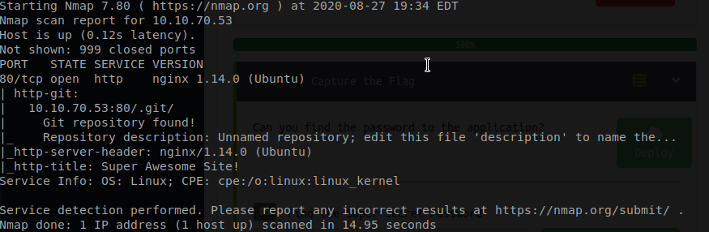
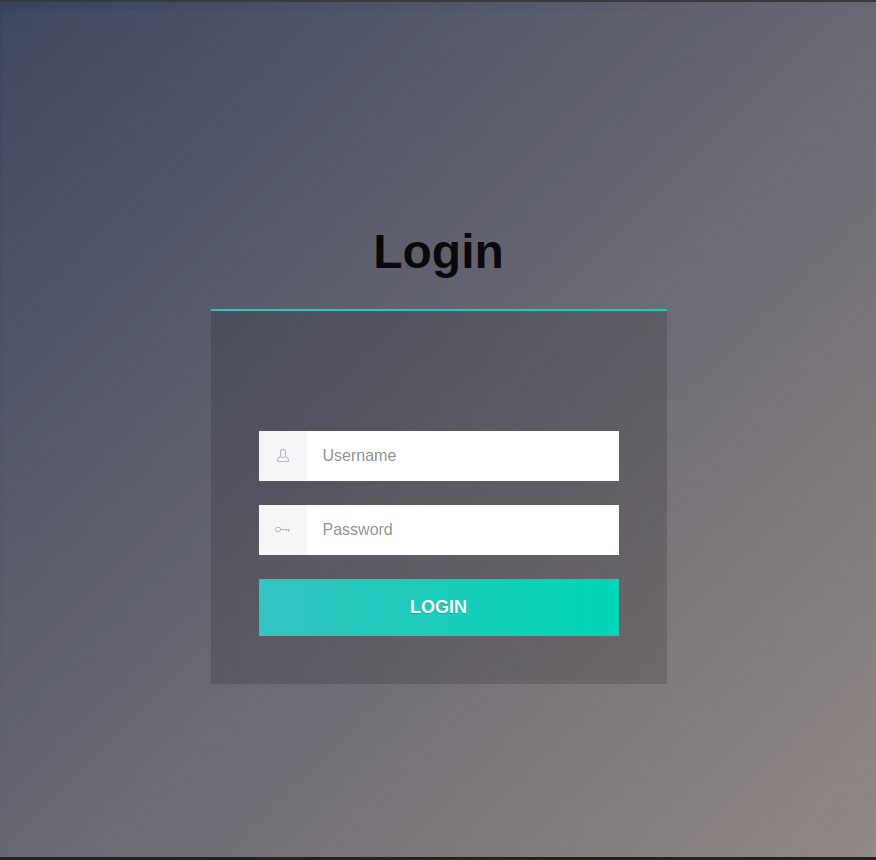
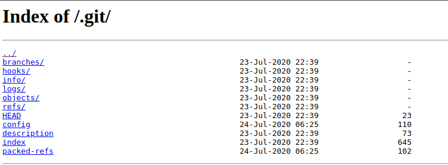
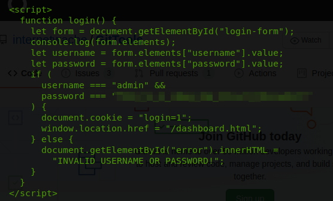

# Try Hack Me - GIT Happes
Boss wanted me to create a prototype, so here it is! We even used something called "version control" that made deploying this really easy!  
---
## Objective:

In this write up we only have one objective and that is to find the Super Secert Password.

---
## Scanning, and Enumeration

The first thing that I am going to do after deploying the box is run an nmap scan.  

NMAP: `nmap -sC -sV -T4 -oN nmap\result.txt <IP>`  
Command Breakdown:
```
-sC: Scan with default NSE scripts. Considered useful for discovery and safe

-sV: Attempts to determine the version of the service running on port

-T4: speed of nmap scan is 4/5 (personal preference of mine)

-oN: Normal output to the file normal.file
```
  

It seems that the only port that is open is 80. So lets put the IP address into our browser and see what happens.  
  


It looks like there is a login page.  
Since this challege is about git and version control I am going to see if the `.git` directory is exposed.  


  

Great! Now since the git directory is exposed I can use [GitTools](https://github.com/internetwache/GitTools) to try and download that repo.  
GitTools: `/gitdumper.sh http://<IP>/.git/ ./GitHappens/`

Once I have download the repos I can use git log to see all the hashes and commit history, but what I really want to find is the commit history.  
This can be down by using `git log -g`, then by pressing `shift + G` I can jump to the very first commit.

  
... and just like that that password is right in front of us in plain text.

---

# Congratulations you have just completed the GIT Happens challenge!